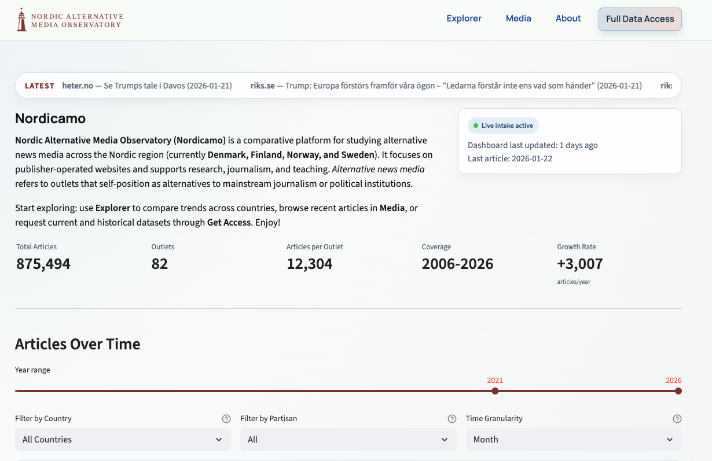

# Nordicamo

Nordic Alternative Media Observatory (Nordicamo) is a comparative platform for studying alternative news media across the Nordic region. It provides structured access to alternative news media content and supports research, journalism, and teaching.

Website: www.nordicamo.org



## Repository scope

- `frontend/` — Streamlit dashboard
- `backend/` — FastAPI API

The **data collection module is not included** in this GitHub repository. Data ingestion, scraping, and pipeline assets are managed separately.

## Run locally (dev)

Backend:
```
cd backend
source .venv/bin/activate
uvicorn app.main:app --host 127.0.0.1 --port 8001
```

Frontend:
```
cd frontend
source .venv/bin/activate
export NAMO_API_BASE_URL=http://127.0.0.1:8001
streamlit run app.py --server.port 8501
```

## Server notes

See the local runbook (not tracked in GitHub) for tmux-based start/stop instructions and dashboard refresh steps.

## Security

Do not commit credentials or private keys. Configure DB and SSH access via environment variables or local `.env` files.
